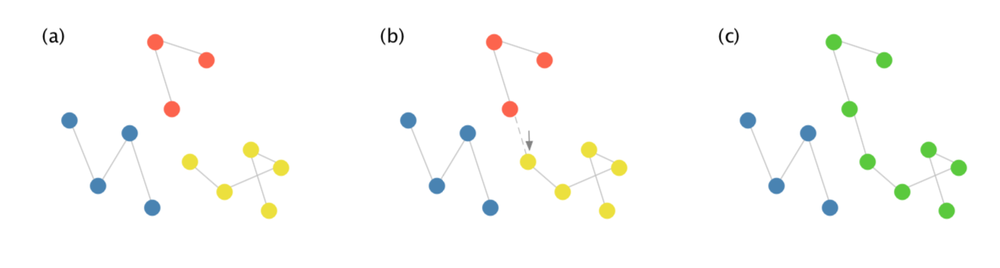
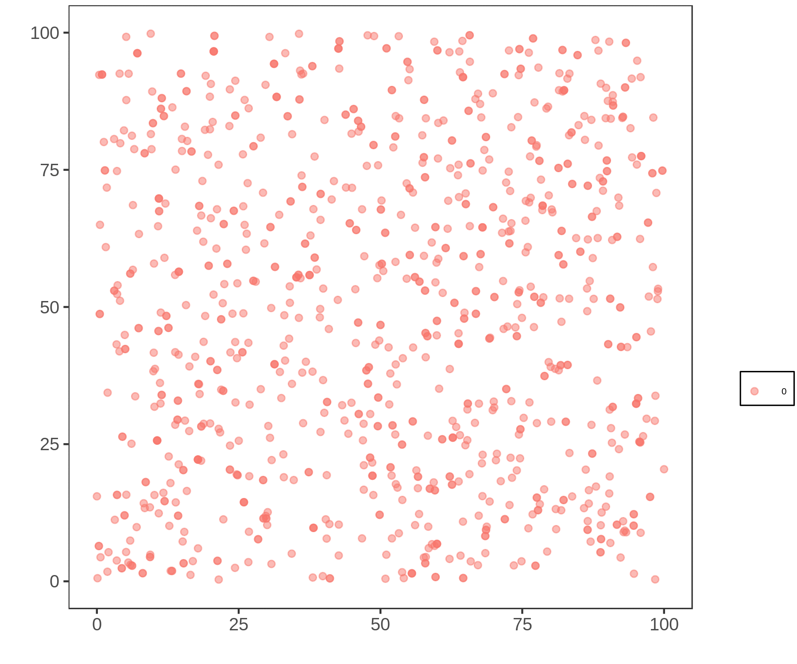

# Introduction

The current work refers to the study of a problem wich arised during the implementation of the IBM of Evolution and Speciation developed by Marcus Aguiar [@aguiarGlobalPatternsSpeciation2009].

The model begins with a single species, homogeneously distributed over a two-dimensional space, of identical individuals (genomically). This species is composed by individuals, who reproduce sexually, leave their offspring in the space, and die.

As the generations pass, the individuals accumulate differences, and speciation occurs when there is no possible genetic flow between two groups of individuals anymore.

The code is explained in detail in this Git Repository https://github.com/IriLrnr/EvIBM, specificaly, the file DETAILED.md, but an overview will be given.

In the code, to represent this population, a graph is implemented, where the vertices corespond to individuals, and an arc exist between two dots if the two individuals are genetically compatible, that is, if their genome has at maximum a certain number of differences.

As the generations pass, species connect and desconnect, as shown bellow (it can be seen forward or backward)

In the image, each set of dots of the same color compose a species. As soon as genetic flow is stablished between a red and a yellow individual, they become the same species.

In graph theory, a subgraph that is not connected to anyone else, is a _**maximal connected component**_, as are the collection of dots of the same color and their arcs in the image above. That is what we are going to call a **species**. This is the genetic flow definition of species [@petitGeneFlowSpecies2009].

This model is spatial model, so the positioning of individuals plays a central roll in species formation. In the current version, the species are agglutinating in points in the space, and resulting in a faster-than-expected exponential growth of the number of species - it works as a parapatric model, when it should be allopatric. The result is this behaviour of the position in the first ten generations:

this is a test for gif

It should be like this, for all the iterations

Another gif without collapse

# Methods

When the code in the [EvIBM repository](#https://github.com/IriLrnr/EvIBM), in branch "position" is compiled, the output is a number of files of the form  

# Bibliography