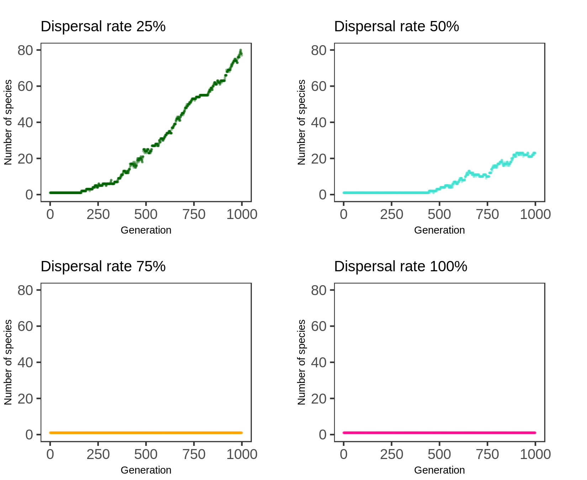

```{r setup, include=FALSE}
knitr::opts_chunk$set(echo = TRUE)
```

## Introduction

The current work refers to the study of a problem wich arised during the implementation of the IBM of Evolution and Speciation developed by Marcus Aguiar [@aguiar2009].

The model begins with a single species, homogeneously distributed over a two-dimensional space, of identical individuals (genomically). This species is composed by individuals, who find a partner reproduce sexually, leave their offspring in the space, and die.

As the generations pass, the individuals accumulate differences, and speciation occurs when there is no possible genetic flow between two groups of individuals anymore.

The code is explained in detail in this Git Repository https://github.com/IriLrnr/EvIBM, specificaly, the file DETAILED.md. In here, the results will be analyzed.

Because the code is based on a model that has already been implemented before, we have some results to look for:

- After 1000 generations, the formation of 20 to 30 species.

- The growth begins around generation 500

- The individuals keep homogeneously distributed

In the code, to represent this population, a graph is implemented, where the vertices corespond to individuals, and an arc exist between two dots if the two individuals are genetically compatible, that is, if their genome has at maximum a certain number of differences.

During the simulation, species connect and desconnect, as shown bellow (it can be seen forward or backward)


In the image, each set of dots of the same color compose a species. As soon as genetic flow is stablished between a red and a yellow individual, they become the same species.

In graph theory, a subgraph that is not connected to anyone else, is a _**maximal connected component**_, as are the collection of dots of the same color and their arcs in the image above. That is what we are going to call a **species**. This is the genetic flow definition of species [@petit2009].

This model is spatial model, so the positioning of individuals plays a central roll in species formation. In the current version, the species are agglutinating in points in the space, and resulting in a faster-than-expected exponential growth of the number of species - it works as a parapatric model, when it should be allopatric. The result is this behaviour of the position in the first twenty generations:


While the expectations for the location is for the population to continue homogenically distributed. The goal of this report is to analyse graphically what is causing the agglutination, using the position gifs and the graphic of the number of species per time.

## Analysis

### Graphics and Gifs

The methods of the implementation of the model is described in the [EvIBM repository](#https://github.com/IriLrnr/EvIBM). It has more than one branch and the output is different. The branch used for this report is the JB branch. It outputs the tables used to make the gifs and images. Look for the git tags for the right images.

The gif for studying position is created in the `space.R` file. It recieves the table of the form

```{r table, eval=TRUE, echo=FALSE}
ind.loc <- read.csv("../data/position/indlocV1.csv", sep = ";")
head(ind.loc)
```

where `id` is the individual, `x` and `y` are it's coordinates, `sp` is it's species, and `gen` is the generation they belong, and returs a gif, where each frame corresponds for the distribution of one generation. The full simulation gif is


It shows the movement of the individuals throughout the simulation, indicating some problems: there is always around 1000 individuals. Why are they agglutinating? Why do they only move in lines?

In the gif above, we can watch species form. How many? The R script `species.R` recieves a table of the form

```{r species, eval=TRUE, echo=FALSE}
number.species <- read.csv("../data/species/numspV1.csv", sep = ";")
head(number.species)
```

where `gen` is the generation and `sp` is the number of species in that generation. It outputs a simple plot


The format of ths graphic is right, but the slope is too inclined, it is happening before it should. The amound of species is also bigger than the model pedicts.

Both images suggest implementation problems.

### Changes in the code

Some functions of the implementation cannot be tested outside the simulation, and some problems, like agglutination, may appear as a "background mistake". Those functions are the ones responsible for reproduction, positioning, and choosing partner.

The features of the model, inside those functions, that may produce those errors are (I think):

  - The dispersal of offspring
  - The fluctuation in `Reproduction`
  
The dispersion is a characteristic of the model, each offspring has 99% chance of being in the same spot as the focal parent, and 1% chance of dispersal inside the radius of the parent. 

```{c, wrongdispersal, eval=FALSE, echo=TRUE}
// In EvIBM, function Offspring_Position(), library functions.h
if (random_number() <= 0.01) {
  movement_y = random_number()*info->radius;
	movement_x = random_number()*info->radius;
	if (random_number() < 0.5) {
		movement_x = -movement_x;
		movement_y = -movement_y;
	}
  //...
}
```

This dispersal rate result in collapse, but increasing this rate gives strange results. The dispersion with 1% chance of dispersal is in the gif above. If we change it we have the distribution of the last generation in the simulation looking like this


and the number of species like this.




The results show that something is wrong. Although patterns in ecology are normal, the reason for this "stripes" of individuals and empty space is at this code chunk: the dispersion should cover all the directions around the focal. But it is clear in the code that `x` and `y` are always both positive, or both negative, wich is just a mistake. This will reflect on the growth of the number of species, because it changes the number of encounters between possible partners. When dispersal is too high, there is no formation of species, wich is predicted.

The right code should for dispersion is this

```{c, rightdispersal, eval=FALSE, echo=TRUE}
// In EvIBM, function Offspring_Position(), library functions.h
if (random_number() <= 0.01) {
  movement_y = (random_number()*2 -1)*info->radius;
  movement_x = (random_number()*2 -1)*info->radius;
  //...
}
```

Changing the code, and using the "right" (1%) chance of dispersion, we obtain the distribution below:


The distribution is a little better, and the number of species doesn't change much. Changing again the disperse rate, the patters should dissapear


And they do. But it is visible that there is still some agglutination. 


Although the distribution looks better, and the number of species and distribution are more coherent, none of the tests above gave satisfactory enough results. Something is still wrong, and maybe the problem is in the `Reproduction` function. 

The intention of making the population fluctuate is to add realism to the model. Lets take a look at the `reproduction` function

```{c, repV2, eval=FALSE, echo=TRUE}
// In EvIBM, function Reproduction(), library functions.h
void Reproduction (Graph G, Population progenitors, Population offspring, Parameters info)
{ 	
	int focal, mate, other, i, n;

	i = 0;

	if (info->population_size < info->number_individuals) {
		for (focal = 0; focal < info->population_size; focal++) {
			if (Verify_Neighborhood (progenitors[focal]->neighborhood) < info->neighbors) {
				mate = Choose_Mate(G, focal, progenitors, info);
				if (mate != -1) {
					Create_Offspring (progenitors, offspring, i, focal, mate, info);
					i++;
					info->population_size ++;
				}
			}
		}
	} 

	for (focal = 0; focal < (G->U); focal++) {
		other = focal; 
		mate = -1;

		if (random_number() < 0.63 && Verify_Neighborhood (progenitors[focal]->neighborhood) > 2) {
			mate = Choose_Mate(G, focal, progenitors, info);
		}

		for (n = 0; n < 2; n++) {
			if (mate == -1) {
				other = Choose_Mate (G, focal, progenitors, info);
				if (other != -1)
					mate = Choose_Mate(G, other, progenitors, info);
			}
		}

		if (mate != -1 && other != -1) {
			Create_Offspring (progenitors, offspring, i, other, mate, info);
			i++;
		}
		else {
			info->population_size --;
		}
	}
}
```

In the firt version of the model, let's call it V1 (it is git tagged in branch JB, just type `git tag` to list them), the fluctiuation is done by simulating a sort with reposition. Each individual has a chance to reproduce, 63%, and if not, one of its neighbors is selected to be focal in it's place. It if can't find a partner, one more neighbor is selected, and if not found, the population decreases in one individual. If population is below 1000 individuals (this is the used size for `info->number_individuals` in the simulations), the individuals who are in the least dense regions have a chance to reproduce, increasing the population. 

The problem is that this fluctiuation is very artificial. There must be another way to do this.

The idea is not to sort which individual reproduces or not, but sort an integer number which determines the number of children an individual will have as focal. This distribution have to include zeros, then is equivalent to the "death", not reproducing. Then, the poisson distribution was chosen, where the mean has to be something that keeps the population around 1000 individuals. The code for this is

```{c, repV3, eval=FALSE, echo=TRUE}
// In EvIBM, function Reproduction(), library functions.h
void Reproduction (Graph G, Population progenitors, Population offspring, Parameters info)
{ 	
	int focal, mate, other, i, n;
	double mu;
	unsigned int number_children; 
	int parent_population_size;

	i = 0;
	parent_population_size = info->population_size;

	mu = ((double) info->number_individuals) / (parent_population_size);

	for (focal = 0; focal < (G->U); focal++) {
		number_children = poisson(mu);
		for (n = 0; n < number_children; n++) {
			mate = Choose_Mate (G, focal, progenitors, info);
			if (mate != -1) {
				Create_Offspring (progenitors, offspring, i, focal, mate, info);
				i++;
			}
		}
		if (number_children > 0) 
			info->population_size += (number_children - 1);
		else {
			info->population_size --;
		}
	}
}
```

I expected good results, but...


more agglutinating and weird behaviour of number of species. And changing the dispersal rate doesn't make things very much better:


Different and more agglutinating patters arise.


Looking again, carefully, into the positioning functions, I noticed a problem.

The first function, the one that checks if an individual and a mate are one in rage of other, in all the versions cited here, looks like this:

```{c, VD, eval=FALSE, echo=TRUE}
// In EvIBM, function Verify_Distance(), library functions.h
int Verify_Distance (Population progenitors, int focal, int mate, Parameters info, int increase)
	{
		int x_compatible, y_compatible, x_out_left, x_out_right, y_out_up, y_out_down;

		y_compatible = 0;
		x_compatible = 0;

		x_out_left = 0;
		x_out_right = 0;
		y_out_up = 0;
		y_out_down = 0;

		/* If an individual ratio reaches an end of the lattice, it will look on the other side, because the lattice work as a toroid */
		if (progenitors[mate]->x <= progenitors[focal]->x + info->radius + increase && progenitors[mate]->x >= progenitors[focal]->x - info->radius + increase) {
			x_compatible = 1;
		}
		if (progenitors[mate]->y <= progenitors[focal]->y + info->radius + increase && progenitors[mate]->y >= progenitors[focal]->y - info->radius + increase) {
			y_compatible = 1;
		}

		if (!x_compatible) {
			if (progenitors[focal]->x + info->radius + increase > info->lattice_width) {
				x_out_right = progenitors[focal]->x + info->radius + increase - info->lattice_width;
				if (progenitors[mate]->x <= x_out_right) {
					x_compatible = 1;
				}
			}
			else if (progenitors[focal]->x - info->radius + increase < 0) {
				x_out_left = progenitors[focal]->x - info->radius + increase + info->lattice_width;
				if (progenitors[mate]->x >= x_out_left) {
					x_compatible = 1;
				}
			}
		}

		if (!y_compatible) {
			if (progenitors[focal]->y + info->radius + increase > info->lattice_lenght) {
				y_out_up = progenitors[focal]->y + info->radius + increase - info->lattice_lenght;
				if (progenitors[mate]->y <= y_out_up) {
					y_compatible = 1;
				}
			}
			else if (progenitors[focal]->y - info->radius + increase < 0) {
				y_out_down = progenitors[focal]->y - info->radius + increase + info->lattice_lenght;
				if (progenitors[mate]->y >= y_out_down) {
					y_compatible = 1;
				}
			}
		}

		if (x_compatible && y_compatible) return 1;
		else return 0;
	}
```

It is looking for the partner in a square, and not in a circle, as it should be. It has a second problem: values that should be floating points are integers. Changing this function, in V3 (with the poisson reproduction), lets call it V3.1, to the following function:

```{c, VD2, eval=FALSE, echo=TRUE}
int Verify_Distance (Population progenitors, int focal, int mate, Parameters info, int increase)
	{
		double x, x0, y, y0, r;
		
		r = info->radius + increase;

		x0 = progenitors[focal]->x;
		y0 = progenitors[focal]->y;
		x = progenitors[mate]->x;
		y = progenitors[mate]->y;

		if (y0 >= info->lattice_lenght - r && y <= r)
			y = y + info->lattice_lenght;

		if (y0 <= r && y >= info->lattice_lenght - r)
			y = y - info->lattice_lenght;

		if (x0 >= info->lattice_width - r && x <= r)
			x = x + info->lattice_width;

		if (x0 <= r && x >= info->lattice_width - r)
			x = x - info->lattice_lenght;

		if ((x - x0) * (x - x0) + (y - y0) * (y - y0) <= r * r)
			return 1;
		else 
			return 0;
	}
```

where it is checking if the partner is inside the focal's circle, we obtain the following results:


The results are the opposite of what was expected, but this is not the only positioning function. We have the function `Offspring_Position`, which puts the offspring in a square around the focal. It looks like this:

```{c, OP, eval=FALSE, echo=TRUE}
// In EvIBM, function Offspring_Position(), library functions.h
void Offspring_Position (Population progenitors, Population offspring, int baby, int focal, Parameters info)
{
	double movement_x, movement_y;

	movement_x = movement_y = 0;

	offspring[baby]->x = progenitors[focal]->x;
	offspring[baby]->y = progenitors[focal]->y;

	if (random_number() <= 0.01) {
		movement_y = (random_number()*2 - 1) * info->radius;
		movement_x = (random_number()*2 - 1) * info->radius;

		if (offspring[baby]->x + movement_x <= info->lattice_width && progenitors[focal]->x + movement_x >= 0)
	  		offspring[baby]->x += movement_x;

		else if (progenitors[focal]->x + movement_x > info->lattice_width)
			offspring[baby]->x = offspring[baby]->x + movement_x - info->lattice_width;

		else if (progenitors[focal]->x + movement_x < 0)
			offspring[baby]->x = offspring[baby]->x + movement_x + info->lattice_width;

		if (progenitors[focal]->y + movement_y <= info->lattice_lenght && progenitors[focal]->y + movement_y >= 0)
	  		offspring[baby]->y = offspring[baby]->y + movement_y;

		else if (progenitors[focal]->y + movement_y > info->lattice_lenght)
			offspring[baby]->y = offspring[baby]->y + movement_y - info->lattice_lenght;

		else if (progenitors[focal]->y + movement_y < 0)
			offspring[baby]->y = offspring[baby]->y + movement_y + info->lattice_lenght;
	}
}
```

Notice it is also putting offspring in a square around the focal. The way to change it is sorting the movement inside the circle, by sorting a radius equal or less then the `info->radius`, and an angle theta, then, extracting x and y coordinates from it.

```{c, OP2, eval=FALSE, echo=TRUE}
// In EvIBM, function Offspring_Position(), library functions.h
void Offspring_Position (Population progenitors, Population offspring, int baby, int focal, Parameters info)
{
	double movement_x, movement_y;
	double r, theta;

	movement_x = movement_y = 0;

	offspring[baby]->x = progenitors[focal]->x;
	offspring[baby]->y = progenitors[focal]->y;

	if (random_number() <= 0.01) {
		r = random_number() * info->radius;
		theta = rand_upto(360) + random_number();

		movement_y = sin(theta) * r;
		movement_x = cos(theta) * r;
		
  //[...]
}
```

The results of this second version (V3.2, with both positioning functions changed) looks like this:


Clearly it is not getting better, indicating more hidden errors in the model. The number os species should look sigmoidal, in this version it is varying too much. Also, the concentration is worse than ever.

Let's see what the second version (V2) looks like with the position changes?

Changing just the `Verify_Distance`, we obtain:


And changing also the `Offspring_Position`, 


In this last simulation, the number of species looks sigmoidal, but it explodes, and the positioning is still agglutinating, even if less, so problem not solved.

Neither of the results are satisfactory enough, because they do not match what is expected by the model. Again, out of ideas...

# Bibliography