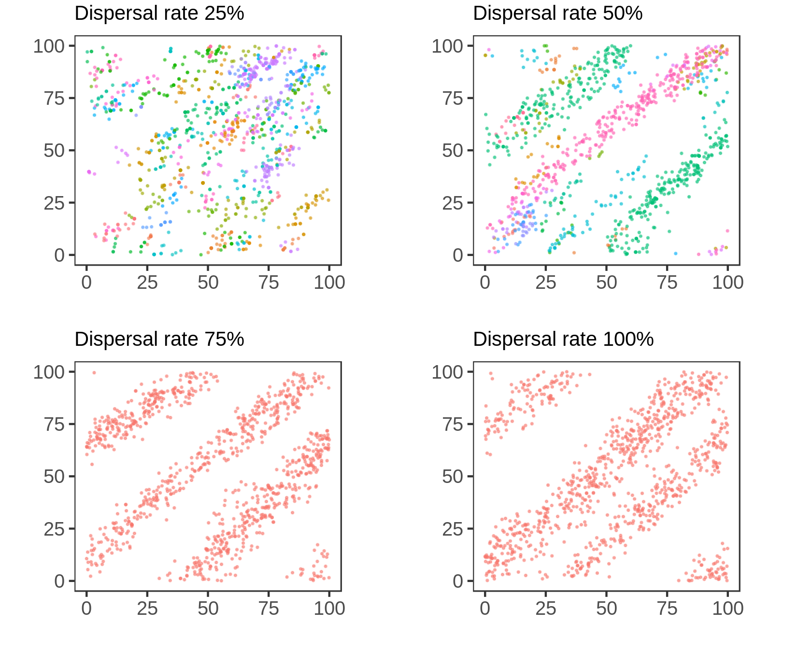
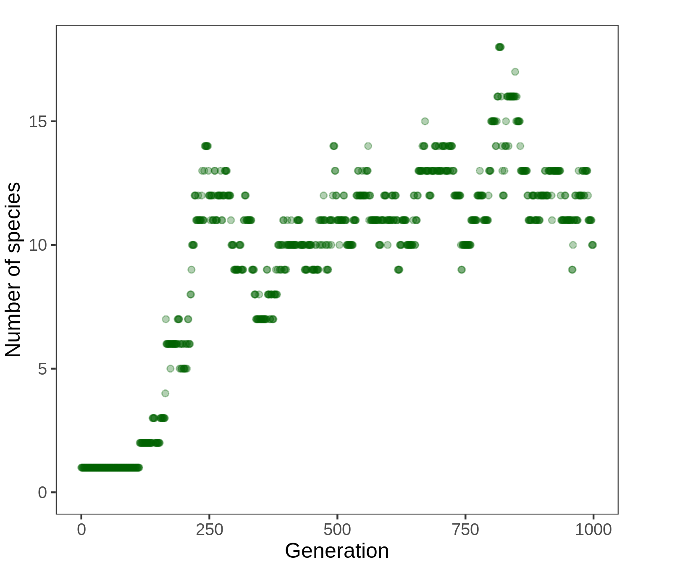

Introduction
------------

The current work refers to the study of a problem wich arised during the
implementation of the IBM of Evolution and Speciation developed by
Marcus Aguiar1.

The model begins with a single species, homogeneously distributed over a
two-dimensional space, of identical individuals (genomically). This
species is composed by individuals, who find a partner reproduce
sexually, leave their offspring in the space, and die.

As the generations pass, the individuals accumulate differences, and
speciation occurs when there is no possible genetic flow between two
groups of individuals anymore.

The code is explained in detail in this Git Repository
<a href="https://github.com/IriLrnr/EvIBM" class="uri">https://github.com/IriLrnr/EvIBM</a>,
specificaly, the file DETAILED.md. In here, the results will be
analyzed.

Because the code is based on a model that has already been implemented
before, we have some results to look for:

-   After 1000 generations, the formation of 20 to 30 species.

-   The growth begins around generation 500

-   The individuals keep homogeneously distributed

In the code, to represent this population, a graph is implemented, where
the vertices corespond to individuals, and an arc exist between two dots
if the two individuals are genetically compatible, that is, if their
genome has at maximum a certain number of differences.

During the simulation, species connect and desconnect, as shown bellow
(it can be seen forward or backward)

In the image, each set of dots of the same color compose a species. As
soon as genetic flow is stablished between a red and a yellow
individual, they become the same species.

In graph theory, a subgraph that is not connected to anyone else, is a
***maximal connected component***, as are the collection of dots of the
same color and their arcs in the image above. That is what we are going
to call a **species**. This is the genetic flow definition of
species2.

This model is spatial model, so the positioning of individuals plays a
central roll in species formation. In the current version, the species
are agglutinating in points in the space, and resulting in a
faster-than-expected exponential growth of the number of species - it
works as a parapatric model, when it should be allopatric. The result is
this behaviour of the position in the first twenty generations:

While the expectations for the location is for the population to
continue homogenically distributed. The goal of this report is to
analyse graphically what is causing the agglutination, using the
position gifs and the graphic of the number of species per time.

Analysis
--------

### Graphics and Gifs

The methods of the implementation of the model is described in the
[EvIBM repository](#https://github.com/IriLrnr/EvIBM). It has more than
one branch and the output is different. The branch used for this report
is the JB branch. It outputs the tables used to make the gifs and
images. Look for the git tags for the right images.

The gif for studying position is created in the `space.R` file. It
recieves the table of the form

    ##   id         x         y sp gen
    ## 1  0 63.945835 75.973488  0   0
    ## 2  1  9.348047 13.490242  0   0
    ## 3  2 52.021008  7.823214  0   0
    ## 4  3  6.990640 20.465508  0   0
    ## 5  4 46.142048 81.967728  0   0
    ## 6  5 57.331860 75.558083  0   0

where `id` is the individual, `x` and `y` are it’s coordinates, `sp` is
it’s species, and `gen` is the generation they belong, and returs a gif,
where each frame corresponds for the distribution of one generation. The
full simulation gif is

It shows the movement of the individuals throughout the simulation,
indicating some problems: there is always around 1000 individuals. Why
are they agglutinating? Why do they only move in lines?

In the gif above, we can watch species form. How many? The R script
`species.R` recieves a table of the form

    ##   gen sp
    ## 1   0  1
    ## 2   1  1
    ## 3   2  1
    ## 4   3  1
    ## 5   4  1
    ## 6   5  1

where `gen` is the generation and `sp` is the number of species in that
generation. It outputs a simple plot

The format of ths graphic is right, but the slope is too inclined, it is
happening before it should. The amound of species is also bigger than
the model pedicts.

Both images suggest implementation problems.

### Changes in the code

Some functions of the implementation cannot be tested outside the
simulation, and some problems, like agglutination, may appear as a
“background mistake”. Those functions are the ones responsible for
reproduction, positioning, and choosing partner.

The features of the model, inside those functions, that may produce
those errors are (I think):

-   The dispersal of offspring
-   The fluctuation in `Reproduction`

The dispersion is a characteristic of the model, each offspring has 99%
chance of being in the same spot as the focal parent, and 1% chance of
dispersal inside the radius of the parent.

    // In EvIBM, function Offspring_Position(), library functions.h
    if (random_number() <= 0.01) {
      movement_y = random_number()*info->radius;
        movement_x = random_number()*info->radius;
        if (random_number() < 0.5) {
            movement_x = -movement_x;
            movement_y = -movement_y;
        }
      //...
    }

This dispersal rate result in collapse, but increasing this rate gives
strange results. The dispersion with 1% chance of dispersal is in the
gif above. If we change it we have the distribution of the last
generation in the simulation looking like this

and the number of species like this.

The results show that something is wrong. Although patterns in ecology
are normal, the reason for this “stripes” of individuals and empty space
is at this code chunk: the dispersion should cover all the directions
around the focal. But it is clear in the code that `x` and `y` are
always both positive, or both negative, wich is just a mistake. This
will reflect on the growth of the number of species, because it changes
the number of encounters between possible partners. When dispersal is
too high, there is no formation of species, wich is predicted.

The right code should for dispersion is this

    // In EvIBM, function Offspring_Position(), library functions.h
    if (random_number() <= 0.01) {
      movement_y = (random_number()*2 -1)*info->radius;
      movement_x = (random_number()*2 -1)*info->radius;
      //...
    }

Changing the code, and using the “right” (1%) chance of dispersion, we
obtain the distribution below:

The distribution is a little better, and the number of species doesn’t
change much. Changing again the disperse rate, the patters should
dissapear

And they do. But it is visible that there is still some agglutination.

Although the distribution looks better, and the number of species and
distribution are more coherent, none of the tests above gave
satisfactory enough results. Something is still wrong, and maybe the
problem is in the `Reproduction` function.

The intention of making the population fluctuate is to add realism to
the model. Lets take a look at the `reproduction` function

    // In EvIBM, function Reproduction(), library functions.h
    void Reproduction (Graph G, Population progenitors, Population offspring, Parameters info)
    {   
        int focal, mate, other, i, n;

        i = 0;

        if (info->population_size < info->number_individuals) {
            for (focal = 0; focal < info->population_size; focal++) {
                if (Verify_Neighborhood (progenitors[focal]->neighborhood) < info->neighbors) {
                    mate = Choose_Mate(G, focal, progenitors, info);
                    if (mate != -1) {
                        Create_Offspring (progenitors, offspring, i, focal, mate, info);
                        i++;
                        info->population_size ++;
                    }
                }
            }
        } 

        for (focal = 0; focal < (G->U); focal++) {
            other = focal; 
            mate = -1;

            if (random_number() < 0.63 && Verify_Neighborhood (progenitors[focal]->neighborhood) > 2) {
                mate = Choose_Mate(G, focal, progenitors, info);
            }

            for (n = 0; n < 2; n++) {
                if (mate == -1) {
                    other = Choose_Mate (G, focal, progenitors, info);
                    if (other != -1)
                        mate = Choose_Mate(G, other, progenitors, info);
                }
            }

            if (mate != -1 && other != -1) {
                Create_Offspring (progenitors, offspring, i, other, mate, info);
                i++;
            }
            else {
                info->population_size --;
            }
        }
    }

In the firt version of the model, let’s call it V1 (it is git tagged in
branch JB, just type `git tag` to list them), the fluctiuation is done
by simulating a sort with reposition. Each individual has a chance to
reproduce, 63%, and if not, one of its neighbors is selected to be focal
in it’s place. It if can’t find a partner, one more neighbor is
selected, and if not found, the population decreases in one individual.
If population is below 1000 individuals (this is the used size for
`info->number_individuals` in the simulations), the individuals who are
in the least dense regions have a chance to reproduce, increasing the
population.

The problem is that this fluctiuation is very artificial. There must be
another way to do this.

The idea is not to sort which individual reproduces or not, but sort an
integer number which determines the number of children an individual
will have as focal. This distribution have to include zeros, then is
equivalent to the “death”, not reproducing. Then, the poisson
distribution was chosen, where the mean has to be something that keeps
the population around 1000 individuals. The code for this is

    // In EvIBM, function Reproduction(), library functions.h
    void Reproduction (Graph G, Population progenitors, Population offspring, Parameters info)
    {   
        int focal, mate, other, i, n;
        double mu;
        unsigned int number_children; 
        int parent_population_size;

        i = 0;
        parent_population_size = info->population_size;

        mu = ((double) info->number_individuals) / (parent_population_size);

        for (focal = 0; focal < (G->U); focal++) {
            number_children = poisson(mu);
            for (n = 0; n < number_children; n++) {
                mate = Choose_Mate (G, focal, progenitors, info);
                if (mate != -1) {
                    Create_Offspring (progenitors, offspring, i, focal, mate, info);
                    i++;
                }
            }
            if (number_children > 0) 
                info->population_size += (number_children - 1);
            else {
                info->population_size --;
            }
        }
    }

I expected good results, but…

more agglutinating and weird behaviour of number of species. And
changing the dispersal rate doesn’t make things very much better:

Different and more agglutinating patters arise.

I’m out of ideas, so the problem was not solved. I need more ideas.

Bibliography
============

1.Aguiar, M.A.M. de, Baranger, M., Baptestini, E.M., Kaufman, L. &
Bar-Yam, Y. Global patterns of speciation and diversity. *Nature*
**460**, 384–387 (2009).

2.Petit, R.J. & Excoffier, L. Gene flow and species delimitation.
*Trends in Ecology & Evolution* **24**, 386–393 (2009).
